# Server Setup and Configuration

Description/Purpose:
- instrsuctions on how to setup and cenfigure a new Linux server for ACI IT services and capabilities.

## Prerequisites
- Terminal
- Access via SSH commands
- SSL Certificates from IT Support
- Download and install MobaXterm
- Known Server IP addresses
  - Dev Server:  10.0.6.38
  - Prod Server: 10.0.6.44

## Assumptions
- Know how to navigate Linux Terminal
- Familiarity with basic Linux commands
- How Nginx works, and it's associated configuration files and keys

## Instructions

Start by creating a new Session in MobaXterm. Open MobaXterm and go to "Sessions -> New Session"
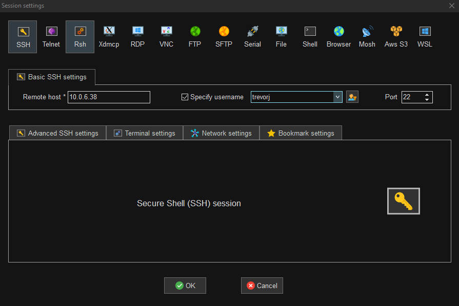

Alternatively if you prefer to use a terminal such as Git-Bash:
• Login to remote server using SSH.
```shell
ssh <username>@<IP>
ssh trevorj@10.0.6.38
```
- 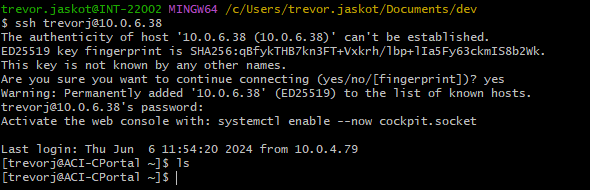

Login with root credentials. IT Support Team (Ben/Randy) will create first accounts with root privileges upon creation of server.
```shell
sudo -i
   -- or alternatively --
su
```
- 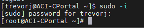

Whomever is the first account(s) created by IT Support Team, they are responsible for creating remaining users.
- [Managing RHEL users](https://access.redhat.com/documentation/en-us/red_hat_enterprise_linux/6/html/deployment_guide/s2-users-cl-tools)

At minimum, this shared account must be created for respective Linux rules of least privileges.
- itsharedroot
  - root privileges
- <env>cportal, such as prodcportal for production environment, or testcportal for testing environment, or devcportal 
for development environment, or labcportal for laboratory sandbox testing environment.
  - devcportal, testcportal, prodcportal - no root privileges should be granted for security reasons.

- This account will manage the Python (Flask and FastAPI) services so that no commands can be destructively executed.
Once all users are created and additional root access is needed, please refer to wheel group and linux administration
for further details. This can be managed by the IT Support Team (Ben and Randy).
- If additional accounts need to be added to root access, add them via whl group.
- Managing Sudo access for RHEL servers can be found here:
  - [Managing Sudo Access](https://docs.redhat.com/en/documentation/red_hat_enterprise_linux/8/html/configuring_basic_system_settings/managing-sudo-access_configuring-basic-system-settings#granting-sudo-access-to-a-user_managing-sudo-access)
```shell
useradd itsharedroot
passwd itsharedroot
```
Adding to root access is managed through wheel group.
```shell
usermod -aG wheel itsharedroot
```

Verify all users have access and passwords are set.
```shell
cat /etc/passwd
```
- 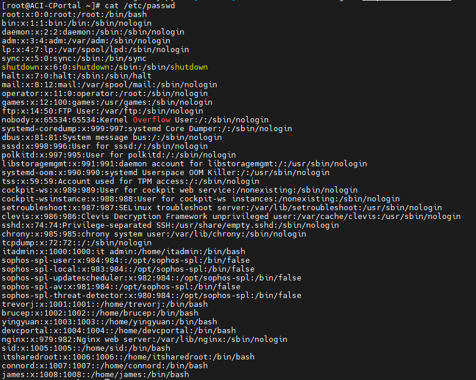

- If non-root account is not already created, create one (ex: prodcportal, devcportal). 
This difference between root and non-root is whether user is added to wheel group.

Look for users and create new ones as necessary.
- Create new rhel user
```shell
useradd -d /home/<dir> <username>
```

- [UserAdd RHEL](https://access.redhat.com/documentation/en-us/red_hat_enterprise_linux/6/html/deployment_guide/s2-users-cl-tools)

Expiring current user password if first time setting, or forgotten
```shell
passwd -e <username>
```
- [RHEL Password Expire](https://www.redhat.com/sysadmin/managing-users-passwd)

Install qmclient license and .so libraries
- Refer to Connor MacLeod for steps. He and James will go into the server and install via shell script
and add associating license.

Install Git and Python and Pip and Pipenv
- Login as Root user with your current user's password and execute installation with dnf (if RHEL 9),
or yum (as secondary install if dnf fails)
- 
- 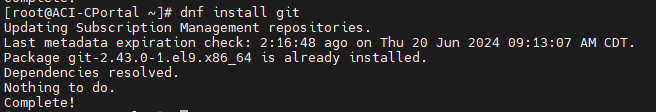
- 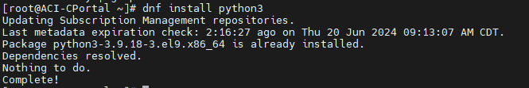

Clone git repos to home directory of non-root account
- Create new session on server
- 

Ensure you are navigated to home directory of <env>cportal account
```shell
cd
or alternatively
cd ~
```
- 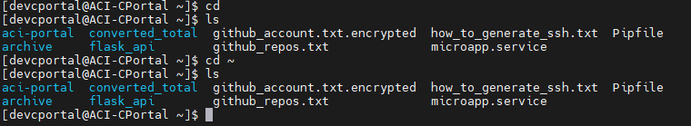

Clone each of the following repositories and their respective branches.
- It is ok if some branches don't exist. If this is the case, create a new branch for downloading purposes.
- [ACI Portal](https://github.com/itacinonprod/aci-portal)
- [Flask Api](https://github.com/itacinonprod/flask_api)

| Name | Environment |
|------|-------------|
| lab  | laboratory  |
| dev  | development |
| test | testing     |
| prod | production  |


Setup git ssh key for each account on server. Follow ssh_key tech primer:
- [Git SSH Key Tech Primer](https://github.com/itacinonprod/Git-Ssh-Tech-Primer)

Setup and install pipenv environments for each previously cloned repository.
- Navigate to repository downloaded
- [Dir Nav](./images/navigate_repo_dir.PNG)

Run following command and it will grab the Pipfile contents and install a new pipenv managed virtual environment 
within. If you need to further manage this environemnt (not recommended for non-advanced users) or to verify this
pipenv environment was created, navigate to /home/<user>/.local/share/virtualenv

```shell
pipenv install
```
- 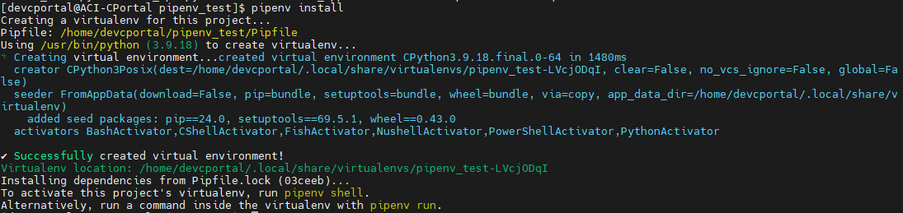

Setup and configure systemctl processes

---------------
**-- IMPORTANT --**

Systemctl and Journalctl configuration and management is written in each base ReadMe.md file of the Git repositories.
These next steps are general guidlines for adding new systemctl services. For much more granular details,
refer to each ReadMe.md.

[Flask ReadMe](https://github.com/itacinonprod/flask_api/blob/main/ReadMe.md)

[FastApi ReadMe](https://github.com/itacinonprod/aci-portal/blob/main/ReadMe.md)

---------------

Login as root user
- 

Copy the <Unit>.service file to the following directory. In this case for Aci Portal the unit.service file
is aci_portal.service, and for flask the unit.service file is flask_app.service.

```shell
[root@ACI-CPortal ~]# cp flask_app.service /etc/systemd/system/
```
- 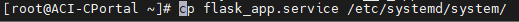

- Start the newly added systemctl service.
- Restart the systemctl daemon.
- View systemctl status

Following commands to be executed:
```shell
sudo cp aci_portal.service /etc/systemd/system
sudo systemctl daemon-reload
sudo systemctl start aci_portal.service
sudo systemctl stop aci_portal.service
sudo systemctl restart aci_portal.service
sudo systemctl status aci_portal.service
sudo systemctl daemon-reload
```

Expose processes via firewall commands 
- Login as root user
- 
- firewall-cmd --permanent --add-port=(portnumber)/(tcp or udp)
- firewall-cmd --reload
- firewall-cmd --list-all
- ss -tupln | grep 8081

Next steps are same for all services needing to be monitored, logged, and orchestrated by Systemctl.
- Port 8080 for flask endpoints
- Login as nonroot user. In this case we are using devcportal
- 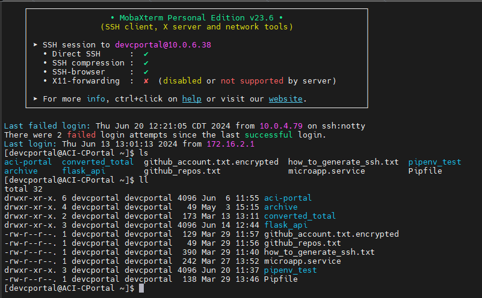
```shell
curl localhost:8080/keeplive
```

- Login as nonroot user. In this case we are using devcportal
- Port 8081 for fastapi endpoints
- 
```shell
curl localhost:8081/keeplive
```

- Login as nonroot user. In this case we are using devcportal
- - Port 8082 for dashboard
- 
```shell
curl localhost:8082/keeplive
```

Setup nginx with dnf (yum) and systemctl
- [Setup Nginx RHEL](https://access.redhat.com/documentation/en-us/red_hat_enterprise_linux/9/html/deploying_web_servers_and_reverse_proxies/setting-up-and-configuring-nginx_deploying-web-servers-and-reverse-proxies)

Setup and configure nginx with certs
- Copy the nginx.conf file under resources directory and place it at:
- [Nginx.conf](./resources/nginx.conf)
```shell
/etc/nginx/nginx.conf
```
- Certs added and configured on server (leverage ben from infrastructure team to assist).

Need to create the private directories for nginx certificates.
```shell
mkdir /etc/pki/nginx
mkdir /etc/pki/nginx/private
```

Once the certificates are granted from IT Support team, copy them to the following locations.
- ssl_certificate "/etc/pki/nginx/server.crt";
- ssl_certificate_key "/etc/pki/nginx/private/server.key"; 

Confirm all services are working through browser and api calls (postman can be used)
- curl 10.0.6.38:8080/keepalive
- 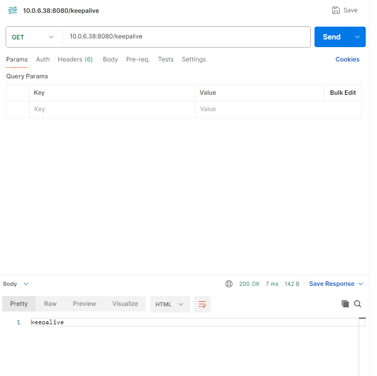
- curl 10.0.6.38:8081/keepalive
- 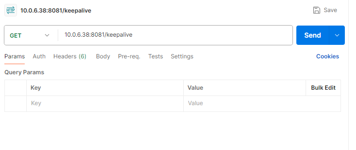

Ask ben to create a DNS name for portal ui on prod server just as he had completed with cportal.stalkerrader.com
in dev server (ACI-CPortal).

You're set! You have now configured with Nginx, Flask, FastApi, Systemctl, Journalctl, Users, and other amazing work!
Here is the architecture you have setup:
- 
